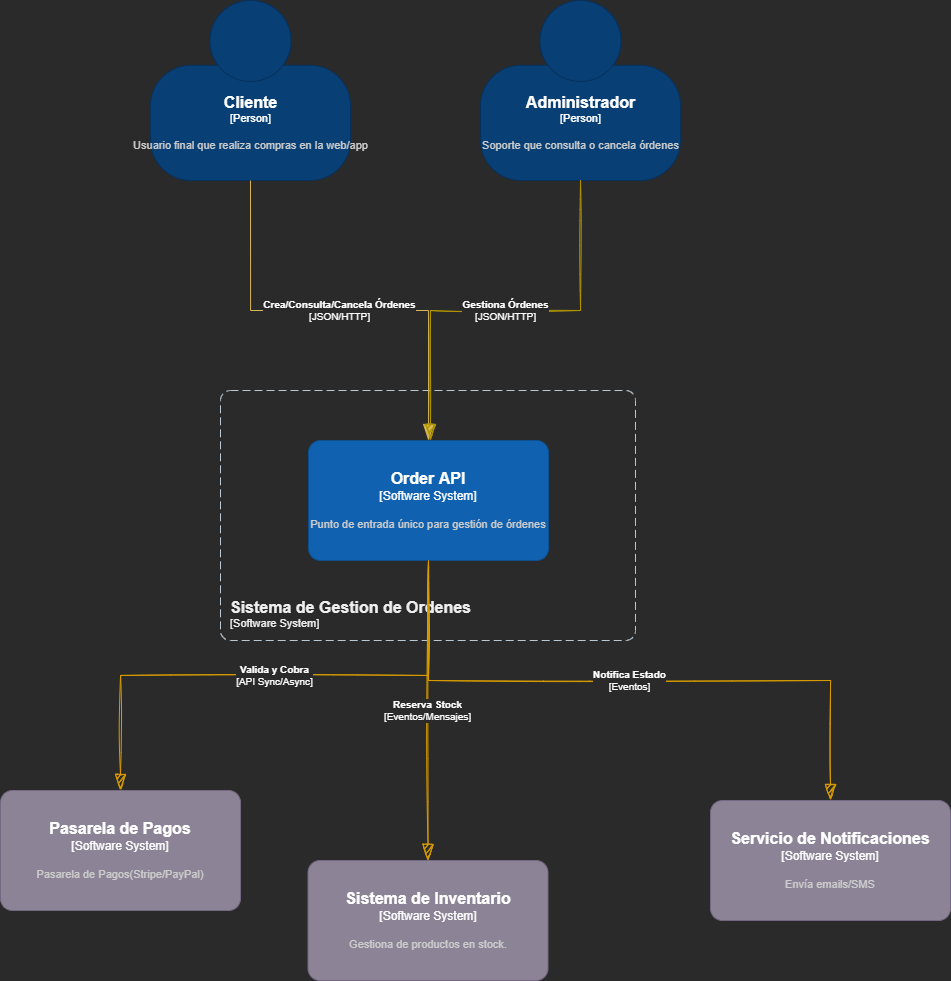
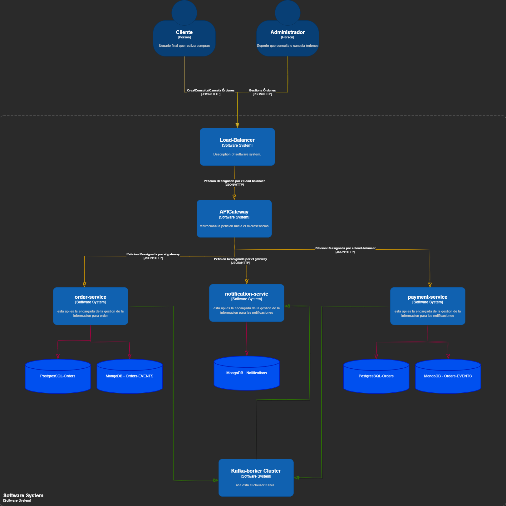

# prueba_quind#  Sistema de Gestión de Órdenes E-commerce
### Arquitectura Event-Driven con Microservicios Reactivos

## Descripción General

Este proyecto implementa un sistema de gestión de órdenes para e-commerce diseñado para escalar horizontalmente y resistir picos de tráfico. La solución moderniza un sistema  sincrónico mediante una arquitectura orientada a eventos, programación reactiva y separación clara de responsabilidades entre microservicios independientes.

### Propósito y Alcance

El sistema gestiona el ciclo de vida completo de una orden de compra: desde su creación hasta la entrega, pasando por validación de inventario, procesamiento de pagos y notificación al cliente. Todo el flujo ocurre de forma asíncrona a través de eventos de dominio publicados en Apache Kafka.

---

## Arquitectura

### Diagrama de Contexto (C4 - Nivel 1)



El sistema expone una única API de entrada consumida tanto por el **Cliente** (crea, consulta y cancela órdenes) como por el **Administrador** (gestión operativa). Internamente se comunica con la Pasarela de Pagos, el Sistema de Inventario y el Servicio de Notificaciones.

---

### Diagrama de Componentes (C4 - Nivel 2/3)



Las peticiones entrantes pasan por un **Load Balancer** (Sticky Sessions) y un **API Gateway Cluster** antes de llegar a los microservicios. Cada servicio gestiona su propia persistencia:

| Servicio | BD Transaccional | Event Store |
|---|---|---|
| order-service | PostgreSQL-Orders | MongoDB-Orders-EVENTS |
| payment-service | PostgreSQL-Payments | MongoDB-Payments-EVENTS |
| notification-service | — | MongoDB-Notifications |


> **Nota:** El Load Balancer y el API Gateway están documentados como parte del diseño arquitectónico. Su implementación completa (ej. Spring Cloud Gateway) está contemplada como mejora futura.

---

### Flujo de Eventos — Crear Orden


---

### Flujo de Eventos — Crear Orden con Inventory Service


---

### Flujo de Eventos — Cancelación de Orden


---

### Máquina de Estados de Órdenes

```
PENDING ──► CONFIRMED ──► PAYMENT_PROCESSING ──► PAID ──► SHIPPED ──► DELIVERED
   │                              │
   └──────────────────────────► CANCELLED
                                  │
                               FAILED
```

---

##  Decisiones Técnicas Principales

### Stack Tecnológico

| Componente | Tecnología | Justificación |
|---|---|---|
| Lenguaje | Java 17 | LTS con records, sealed classes y mejoras de rendimiento |
| Framework | Spring Boot 3.x + WebFlux | Soporte nativo a programación reactiva no bloqueante |
| Message Broker | Apache Kafka | Alto throughput, persistencia de eventos y capacidad de replay |
| DB Transaccional | PostgreSQL + R2DBC | Consistencia ACID con driver reactivo no bloqueante |
| Event Store | MongoDB (reactivo) | Esquema flexible ideal para eventos heterogéneos |
| Contenedores | Docker + Docker Compose | Portabilidad y reproducibilidad del entorno completo |

### Patrones Implementados

- **Clean / Hexagonal Architecture**: El dominio no depende de ningún framework. Puertos definen contratos, adaptadores los implementan.
- **CQRS**: Separación explícita entre comandos (crear, cancelar) y queries (consultar, listar).
- **Event Sourcing Híbrido**: El estado de cada orden se reconstruye desde su historial de eventos en MongoDB.
- **Saga Pattern (Coreografía)**: Cada servicio reacciona a eventos y publica los propios, sin orquestador central.
- **Outbox Pattern**: Garantiza consistencia eventual entre escritura en BD y publicación en Kafka.
- **Sticky Sessions**: El Load Balancer enruta solicitudes del mismo cliente al mismo nodo del cluster.
- **Repository Pattern**: Abstracción de persistencia detrás de interfaces de dominio.
- **Builder / Factory**: Construcción controlada de agregados complejos como `Order` y `Payment`.

### Trade-offs Realizados

- Se eligió **coreografía sobre orquestación** en la Saga para reducir el acoplamiento entre servicios, asumiendo mayor complejidad en el rastreo de flujos distribuidos.
- Se optó por **Sticky Sessions en el Load Balancer** para garantizar consistencia de sesión en el cluster, a costo de una distribución de carga menos uniforme.
- El **Load Balancer y API Gateway** se diseñaron y documentaron arquitectónicamente pero su implementación completa queda como mejora futura, priorizando la funcionalidad core del dominio.
- **PostgreSQL + R2DBC** se prefirió sobre BDs puramente reactivas (Cassandra) para mantener consistencia transaccional sin sacrificar reactividad.

> Los razonamientos completos de cada decisión se encuentran en [`/docs/ADRs/`](./docs/ADRs/).

---

## 📐 Architecture Decision Records (ADRs)

El proyecto documenta **8 decisiones arquitectónicas** con contexto, alternativas evaluadas y consecuencias:

| ADR | Decisión | Consecuencias clave |
|---|---|---|
| [ADR-001](./docs/ADRs/ADR-001-microservices-architecture.md) | **Arquitectura de Microservicios independientes** — desacoplamiento, escalabilidad por dominio | Cada servicio tiene su propia BD, sin foreign keys entre servicios, comunicación asíncrona vía eventos |
| [ADR-002](./docs/ADRs/ADR-002-asynchronous-communication-kafka.md) | **Apache Kafka como broker de eventos** — desacoplamiento fuerte y soporte para Saga distribuida | Eventual consistency, necesidad de idempotencia en consumidores y uso de Outbox Pattern |
| [ADR-003](./docs/ADRs/ADR-003-saga-orchestration-events.md) | **Saga distribuida por eventos** para creación y cancelación de órdenes (Order + Payment + Inventory) | Sin transacciones distribuidas, eventos compensatorios modelados explícitamente, sistema eventualmente consistente |
| [ADR-004](./docs/ADRs/ADR-004-hybrid-event-sourcing-order-service.md) | **Event Sourcing híbrido solo en Order Service** — estado actual en PostgreSQL, eventos en MongoDB | Mayor complejidad en Order Service, pero auditoría completa y replay posible |
| [ADR-005](./docs/ADRs/ADR-005-outbox-pattern.md) | **Outbox Pattern en todos los servicios** — publicación confiable de eventos evitando inconsistencias con Kafka | Worker adicional de polling, gestión de reintentos, mayor confiabilidad en la entrega de eventos |
| [ADR-007](./docs/ADRs/ADR-007-Separación-de-Read-Model-CQRS-Light.md) | **Read Model separado (CQRS Light)** — modelo optimizado para consultas independiente del transaccional | Duplicación controlada de datos, eventual consistency en lecturas, mejor performance en queries |
| [ADR-008](./docs/ADRs/ADR-008-sticky-sessions-load-balancer.md) | **Sticky Sessions en el Load Balancer** para operaciones críticas con afinidad de sesión | Mejor coherencia temporal en flujos síncronos, a costo de distribución menos stateless |
| [ADR-009](./docs/ADRs/ADR-009-postgresql-for-transactional-persistence.md) | **PostgreSQL para estado actual** de agregados (orders, payments, inventory) — descartando MongoDB compartido | Consistencia fuerte, soporte natural para transacciones ACID e implementación del Outbox Pattern |

---

##  Prerequisitos

| Herramienta | Versión mínima            |
|-------------|---------------------------|
| Docker      | 24.x                      |
| Docker Compose | 2.x (plugin integrado) |
| Java JDK    |   17                      |
| Maven       | 3.9.x                     |
| Git         | 2.x                       |

---

##  Instalación y Ejecución

### 1. Clonar el repositorio

```bash
git clone https://github.com/carmagedon07/prueba_quind.git
cd prueba_quind
git checkout develop_checkout_2
```

### 2. Configurar variables de entorno

```bash
cp .env.example .env
```

Los valores por defecto del `.env.example` permiten ejecutar el proyecto sin modificaciones adicionales.

### 3. Levantar toda la infraestructura

```bash
docker-compose up --build
```

Esto levanta automáticamente:
- Apache Kafka + Zookeeper
- PostgreSQL (órdenes, pagos, inventario)
- MongoDB (event store, notificaciones)
- Order Service (`:8082`)
- Payment Service (`:8084`)
- Notification Service (`:8086`)
- Inventory Service (`:8083`)


##  Ejecución de Tests

### Ejecutar toda la suite

```bash
mvn test
```

### Ejecutar por módulo

```bash
cd order-service        && mvn test
cd payment-service      && mvn test
cd notification-service && mvn test
cd inventory-service    && mvn test
```


##  Endpoints Disponibles

###  Order Service — `http://localhost:8082`

| Método | Endpoint | Descripción |
|---|---|---|
| `POST` | `/api/v1/orders` | Crear nueva orden |
| `GET` | `/api/v1/orders/{id}` | Obtener orden por ID |
| `GET` | `/api/v1/orders?customerId={id}` | Listar órdenes del cliente (paginado) |
| `PATCH` | `/api/v1/orders/{id}/cancel` | Cancelar orden (solo PENDING o CONFIRMED) |
| `GET` | `/api/v1/orders/{id}/events` | Historial de eventos (Event Sourcing) |

**Ejemplo — Crear orden:**
```bash
curl -X POST http://localhost:8082/api/v1/orders \
  -H "Content-Type: application/json" \
  -d '{
    "customerId": "customer-001",
    "items": [
      { "productId": "prod-100", "quantity": 2, "unitPrice": 49.99 }
    ]
  }'
```

**Respuesta exitosa (`201 Created`):**
```json
{
  "orderId": "ord-abc123",
  "status": "PENDING",
  "customerId": "customer-001",
  "total": 99.98,
  "createdAt": "2025-02-28T10:00:00Z"
}
```

---

### 🟢 Payment Service — `http://localhost:8084`

| Método | Endpoint | Descripción |
|---|---|---|
| `GET` | `/api/v1/payments/{orderId}` | Consultar estado de pago |
| `POST` | `/api/v1/payments/{orderId}/retry` | Reintentar procesamiento fallido |

---

### 🟡 Notification Service — `http://localhost:8086`

| Método | Endpoint | Descripción |
|---|---|---|
| `GET` | `/api/v1/notifications?orderId={id}` | Consultar notificaciones enviadas por orden |

---


###  Swagger UI

| Servicio | URL |
|---|---|
| Order Service | [http://localhost:8082/swagger-ui.html](http://localhost:8080/swagger-ui.html) |
| Payment Service | [http://localhost:8084/swagger-ui.html](http://localhost:8081/swagger-ui.html) |
| Notification Service | [http://localhost:8086/swagger-ui.html](http://localhost:8082/swagger-ui.html) |


Los archivos OpenAPI también están disponibles en [`/docs/api/`](./docs/api/).

---

##  Estructura del Repositorio

```
prueba_quind/
├── docs/
│   ├── ADRs/
│   │   ├── ADR-001-microservices-architecture.md
│   │   ├── ADR-002-asynchronous-communication-kafka.md
│   │   ├── ADR-003-saga-orchestration-events.md
│   │   ├── ADR-004-hybrid-event-sourcing-order-service.md
│   │   ├── ADR-005-outbox-pattern.md
│   │   ├── ADR-007-Separación-de-Read-Model-CQRS-Light.md
│   │   ├── ADR-008-sticky-sessions-load-balancer.md
│   │   └── ADR-009-postgresql-for-transactional-persistence.md
│   ├── architecture/
│   │   ├── diagrama-contexto-sistema.png
│   │   ├── component-diagram.png
│   │   ├── Event-Flow-Crear_Orden.png
│   │   ├── Event-Flow-Crear_Orden_con-inventario_LB_.png
│   │   └── Event-Flow-Cancelacion_mmd.png
│   └── api/
│       ├── order-service-openapi.yaml
│       ├── payment-service-openapi.yaml
│       ├── notification-service-openapi.yaml
│       ├── inventory-service-openapi.yaml
│       └── postman-collection.json
├── order-service/
│   ├── src/
│   ├── pom.xml
│   └── Dockerfile
├── payment-service/
│   ├── src/
│   ├── pom.xml
│   └── Dockerfile
├── notification-service/
│   ├── src/
│   ├── pom.xml
│   └── Dockerfile
├── inventory-service/
│   ├── src/
│   ├── pom.xml
│   └── Dockerfile
├── docker-compose.yml
├── .env.example
├── README.md
├── EVALUATION.md
└── .gitignore
```

Cada microservicio sigue internamente la estructura de **Clean / Hexagonal Architecture**:

```
{servicio}/src/main/java/
├── domain/
│   ├── model/           # Entidades, agregados y value objects
│   ├── event/           # Domain events
│   └── port/            # Interfaces (puertos de entrada y salida)
├── application/
│   ├── command/         # Casos de uso de escritura (CQRS)
│   └── query/           # Casos de uso de lectura (CQRS)
└── infrastructure/
    ├── adapter/
    │   ├── web/         # Controllers WebFlux
    │   ├── persistence/ # Repositorios R2DBC / MongoDB
    │   └── messaging/   # Producers y Consumers Kafka
    └── config/          # Configuración de Spring
```

---

## 🔭 Observabilidad

- **Logs estructurados** en formato JSON con `correlationId` propagado en headers HTTP (`X-Correlation-Id`) y contexto de logs.
- **Spring Boot Actuator** habilitado en todos los servicios: `/actuator/health`, `/actuator/metrics`, `/actuator/info`.
- **Correlation ID**: cada request genera un identificador único que se propaga a través de todos los servicios involucrados en el flujo para trazabilidad end-to-end.

---

## 🔮 Mejoras Futuras

**Corto plazo:**
- Implementar **Spring Cloud Gateway** como API Gateway real con rate limiting, autenticación centralizada y routing dinámico.
- Agregar **Redis** como capa de caché reactivo para consultas frecuentes de estado de órdenes.
- Completar **Circuit Breaker** con Resilience4j en todas las llamadas entre servicios.

**Mediano plazo:**
- Agregar **Distributed Tracing** con OpenTelemetry + Jaeger para visibilidad end-to-end entre microservicios.
- Implementar **Kafka Streams** para procesamiento complejo de eventos (ej: detección de anomalías en tiempo real).
- Migrar los diagramas a **C4 Model nivel 3** con mayor detalle de componentes internos.

**Largo plazo:**
- Agregar un **portal de administración** con métricas de negocio en tiempo real usando Server-Sent Events (SSE).
- Evaluar migración a **schema registry** (Confluent) para versionado formal de contratos de eventos Kafka.

---

## 📂 Documentación Adicional

- [ADR-001: Arquitectura de Microservicios](./docs/ADRs/ADR-001-microservices-architecture.md)
- [ADR-002: Comunicación Asíncrona con Kafka](./docs/ADRs/ADR-002-asynchronous-communication-kafka.md)
- [ADR-003: Saga por Coreografía de Eventos](./docs/ADRs/ADR-003-saga-orchestration-events.md)
- [ADR-004: Event Sourcing Híbrido en Order Service](./docs/ADRs/ADR-004-hybrid-event-sourcing-order-service.md)
- [ADR-005: Outbox Pattern para Consistencia Eventual](./docs/ADRs/ADR-005-outbox-pattern.md)
- [ADR-007: Separación de Read Model (CQRS Light)](./docs/ADRs/ADR-007-Separación-de-Read-Model-CQRS-Light.md)
- [ADR-008: Sticky Sessions en Load Balancer](./docs/ADRs/ADR-008-sticky-sessions-load-balancer.md)
- [ADR-009: PostgreSQL para Persistencia Transaccional](./docs/ADRs/ADR-009-postgresql-for-transactional-persistence.md)
- [Autoevaluación (EVALUATION.md)](./EVALUATION.md)

---

##  Autor

**Pablo Caro**  
Prueba Técnica — Dev Senior Java  

